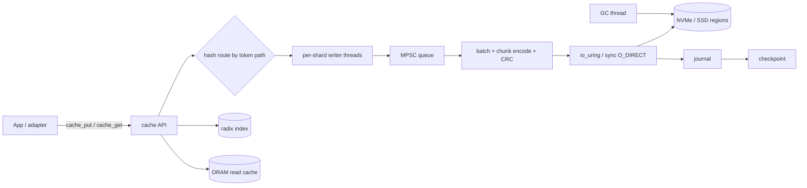

# kvtier

**SSD/NVMe KV-cache offload for LLM inference.** kvtier turns token-indexed
KV-cache groups into append-only, generation-managed storage on one or more
NVMe/SSD devices. Its zero-copy generational GC keeps steady-state write
amplification near 1 (reference runs ≈ 1.02), while multi-disk hashing, large
chunk striping, hot-prefix dual copies and a DRAM read cache keep latency low.

The core is **C++20** behind a stable **C ABI** (`include/kvtier.h`).


---

## Why kvtier?

GPU HBM is the scarcest resource in LLM serving. Long prefix caches and
multi-session serving push KV-cache far beyond what HBM (or host DRAM) can hold.
kvtier uses the SSD layer as a durable, high-capacity extension:

- **Write amplification matters.** Flash hates random 4K overwrites. kvtier
  writes each KV group once into a region, then reclaims whole generations by
  dropping/trimming regions instead of rewriting live data.
- **Reads should be sequential.** Chunks are laid out contiguously; large chunks
  are striped across devices and reassembled in parallel.
- **Crash consistency is required.** Acknowledged puts survive a hard kill and
  are recovered from a journal + checkpoint on reopen.
- **Loss is recoverable.** KV-cache can be recomputed, so RAID-level disk
  redundancy is not a hard requirement.

---

## Key features

**Write path**

- **Hash routing.** The prefix id plus token path select a shard, so writes to
  different disks proceed in parallel.
- **Group-commit batching.** A per-shard writer thread drains an MPSC ring and
  coalesces requests into batches (floor set by `batch_min_bytes`).
- **Append-only chunks.** Each batch is encoded as one or more chunks
  (`ChunkHdr` + per-layer records + CRC32) and appended sequentially to the
  current region, with a watermark flush every few pages.
- **Durable publish.** A matching journal record is written, then the leaf is
  published into the radix index; the put `ack` fires only after the chunk is
  durable.

**Read path**

- `cache_get` walks the radix index along the token-hash path down to the
  `(prefix_id, group_idx)` leaf.
- Every chunk is CRC-validated before use.
- Large chunks are striped across devices and reassembled in parallel; if one
  replica fails its CRC, the dual copy is used.
- The optional DRAM read cache (SIEVE) serves hot groups before touching the SSD.

**Reclaim / GC**

- **Generations.** Regions carry an epoch; the oldest generation is discarded
  first (FRU) once live bytes cross `gc_start_pct`, and GC keeps running until
  `gc_stop_pct` (hysteresis).
- **TTL and TRIM.** A TTL sweep expires entries; empty frozen regions are
  TRIMmed after their epoch.
- **Reader pins.** `refcnt` defers eviction (`KV_EBUSY`); evicted keys are
  tombstoned, so callers can distinguish `KV_ENOENT` (never existed) from
  `KV_EVICTED`.

**Crash recovery**

- CRC-checked superblock pages 0/1 are written alternately so a torn write
  cannot lose the newest state.
- A checkpoint plus the append-only journal replay every acknowledged put on
  reopen, and `live_bytes` is recomputed.

**Storage & devices**

- `Device` abstraction + `FileDevice` with `O_DIRECT`; `IoRing` uses `io_uring`
  on Linux and falls back to synchronous I/O elsewhere.
- Multi-disk hashing, large-chunk striping, hot-prefix dual copies.
- DRAM read cache with `hugetlbfs` → THP → plain huge-page degradation.

**Model-aware tuning**

- Optional adapter-side module computes per-token/per-group KV bytes for
  MHA/MQA/GQA/MLA/SWA/SSM/hybrid/sparse attention and derives layout knobs
  (`stripe_unit`, `batch_min_bytes`, `region_align_bytes`, …), including from a
  HuggingFace `config.json`.

---

## Architecture at a glance



**Data flow**

- **Write:** `cache_put` hashes the prefix + token path to pick a shard, enqueues
  descriptors (the cache copies what it needs), and the shard writer encodes a
  chunk, appends it sequentially to the current region, writes a journal record,
  then publishes the leaf in the radix index. The `ack` callback fires after the
  chunk is durable.
- **Read:** `cache_get` walks the radix index by token hashes, validates the
  chunk CRC, and returns a record stream. Striped chunks are read in parallel
  and reassembled; a failed replica falls back to its dual copy.
- **Reclaim:** a background GC thread drops the oldest generation once live
  bytes cross the start watermark and keeps dropping until the stop watermark
  (hysteresis); pinned readers defer eviction (`KV_EBUSY`).
- **Recover:** on open, a CRC-checked superblock selects the newest state, then
  the checkpoint and journal are replayed and `live_bytes` is recomputed.

---

## Getting started

A clean checkout to a verified running cache, in four steps. Every step lists the
command and the output you should see.

### 1. Prerequisites

- A C++20 compiler (GCC 11+, Clang 14+, or AppleClang 14+)
- CMake ≥ 3.20
- POSIX threads

```sh
c++ --version
cmake --version
```

`cmake --version` should report 3.20 or newer. Linux is recommended
(`io_uring` + `O_DIRECT`); macOS works through the synchronous-I/O fallback.

### 2. Build

```sh
git clone https://github.com/nuclearball/kvtier.git
cd kvtier
cmake -S . -B build -DCMAKE_BUILD_TYPE=Release
cmake --build build -j
```

The build ends with `[100%] Built target ...`. Check that the artifacts exist:

```sh
ls build/libkvtier.a build/demo build/bench build/kv-profile
```

CMake options:

| Option | Default | Meaning |
|---|---|---|
| `SC_BUILD_TESTS` | `ON` | Build the `test_*` binaries and register them with CTest |
| `SC_BUILD_EXAMPLES` | `ON` | Build `demo`, `bench`, `kv-profile` |
| `SC_BUILD_SHARED` | `ON` | Also build the shared library (`libkvtier.dylib`/`.so`) |
| `SC_CUCKOO` | `OFF` | Use a cuckoo filter instead of the direct-mapped tombstone ring |
| `SC_ENABLE_ASAN` | `OFF` | Build with AddressSanitizer + UndefinedBehaviorSanitizer |

**Artifacts:** `build/libkvtier.a`, the shared library (`.dylib`/`.so`),
`build/libkvtier_mp.a` (the model-profile helper), `build/demo`,
`build/bench`, `build/kv-profile`, and the `build/test_*` binaries.

### 3. Run the test suite

```sh
ctest --test-dir build --output-on-failure
```

Expected:

```
100% tests passed out of 12
```

On failure, `--output-on-failure` prints the failing check. Re-run a single test
with `ctest --test-dir build -R test_cache --output-on-failure`.

### 4. Run the end-to-end demo

```sh
./build/demo
```

Expected:

```
session: hits=100/100  leaves=100  writes=400KiB
recovered after reopen: 100/100
```

The demo writes 100 prefixes, reads them back, **closes** the cache, **reopens**
the same device files, and re-verifies every key. The second line is the
crash-recovery check (checkpoint + journal replay); the process exits non-zero on
any mismatch.

### Verify the whole quickstart in one shot

```sh
cmake -S . -B build -DCMAKE_BUILD_TYPE=Release \
 && cmake --build build -j \
 && ctest --test-dir build --output-on-failure \
 && ./build/demo | grep -q "recovered after reopen: 100/100" \
 && echo "QUICKSTART OK"
```

Expected final line: `QUICKSTART OK`.

### Use it from another CMake project

```sh
cmake --install build --prefix /your/prefix
```

```cmake
find_package(kvtier CONFIG REQUIRED)
target_link_libraries(your_app PRIVATE kvtier::kvtier)
# model-aware layout helper (optional):
# target_link_libraries(your_app PRIVATE kvtier::kvtier_mp)
```

The C ABI is backed by a C++ core, so a pure-C consumer must link with the C++
runtime: list `CXX` in `project(...)` (or, for manual builds, link with `c++`
instead of `cc`).

### Next steps

- Derive layout knobs for a model:
  ```sh
  ./build/kv-profile --list
  ./build/kv-profile deepseek-v3
  ```
- Generate load and export metrics (timings vary; `failed` and `miss` must be 0):
  ```sh
  ./build/bench u 2000 4096 2 /tmp/bench.csv /tmp 2 0 32
  ```
  ```
  [u] write: 2000 ops, 0 failed, ... ops/s
  [u] read : 2000 ops, 0 miss/fail, ... ops/s
  [u] recov: ...s open+verify, 2000/2000 readable
  ```
- Write your own program against the C ABI — see Quick start (C) below.

---

## Repository layout

```
kvtier/
├── include/                 public C ABI (kvtier.h, model_profile.h, kv_config_*)
├── src/
│   ├── common / crc32 / hash      utilities (aligned alloc, clocks, CRC32, hashing)
│   ├── device / io               Device abstraction + io_uring / sync I/O
│   ├── chunk / region            chunk codec, region state machine, superblock
│   ├── radix / journal / cuckoo  position-hash radix, journal + checkpoint, tombstone
│   ├── hot / metrics / dram      hotness decay, metrics, DRAM read cache
│   ├── writer / gc               per-shard writer threads + GC
│   ├── cache                     API assembly, crash recovery (+ C ABI wrappers)
│   └── model_profile.cpp         adapter-side model-aware layout (separate module)
├── tests/                   12 tests, wired into CTest
├── examples/                demo (end-to-end), bench (load generator + CSV metrics)
├── tools/                   kv-profile + config schema / generator
└── adapters/
    ├── sglang/              Python ctypes bindings + SGLang backend + pytest
    └── llama/               llama.cpp save/restore integration (C++, CMake)
```

---

## Quick start (C)

```c
#include "kvtier.h"
#include <stdint.h>
#include <string.h>

static volatile int g_acked = -999;
static void on_ack(void *user, int rc) { (void)user; g_acked = rc; }

int main(void) {
    struct kv_config cfg;
    kv_config_default(&cfg);
    cfg.region_cnt        = 6;
    cfg.region_size_pages = 512;  /* 2 MiB/region; 2 devs x 6 x 2 MiB = 24 MiB */

    const char *uris[] = { "dev0.img", "dev1.img" };
    cache_t *c = NULL;
    if (cache_open(&c, uris, 2, &cfg) != KV_EOK)
        return 1;

    /* One 32-token group, one KV record per layer. For async put, the cache
     * copies the descriptors and buffers before returning. */
    uint8_t  kv[1024];
    uint32_t tokens[32];
    memset(kv, 0xAB, sizeof(kv));
    for (int i = 0; i < 32; i++) tokens[i] = (uint32_t)i;

    struct kv_data_ref recs[1] = { { .base = kv, .off = 0, .len = sizeof(kv) } };
    uint64_t prefix_id = 0x1234;   /* hash of the full prefix string */

    if (cache_put(c, prefix_id, /*group_idx=*/0, tokens, /*n_tokens_total=*/32,
                  /*expire_ts=*/0, /*n_layers=*/1, recs, on_ack, NULL) != KV_EOK) {
        cache_close(c);
        return 1;
    }
    while (g_acked == -999) { /* spin / sleep in real code */ }
    if (g_acked != KV_EOK) { cache_close(c); return 1; }

    struct cache_get_result res;
    if (cache_get(c, prefix_id, tokens, 32, &res) == KV_EOK) {
        /* res.buf holds the record stream; res.recs[i] gives layer/off/len */
        cache_result_free(&res);
    }

    cache_close(c);
    return 0;
}
```

**Semantics worth knowing**

- `prefix_id` identifies the prefix string; `group_idx` is the 32-token group
  index. The logical address is `(prefix_id, group_idx)`.
- `cache_put` does not copy caller buffers *synchronously*; the cache keeps what
  it needs and encodes later. Callers using Python/ctypes must hold buffers
  until `ack`.
- `cache_get` returns the deepest matching group. A key that never existed gives
  `-KV_ENOENT`; a key discarded by GC/eviction gives `-KV_EVICTED`.
- A single device file must be opened by one `cache_t` at a time.
- The full set of `kv_config` fields is documented in `include/kv_config_gen.h`
  (generated from `tools/config_schema.json`).

---

## Adapters

- **SGLang** (`adapters/sglang`) — Python ctypes bindings plus a
  `HiCacheStorage`-compatible backend, validated against SGLang 0.5.18 page
  semantics (multi-record pages, content-addressed dedup, GC, crash recovery).
- **llama.cpp** (`adapters/llama`) — C++ adapter that saves/restores a
  sequence's KV state as an opaque blob via `llama_state_seq_get_data` /
  `llama_state_seq_set_data`.

See each adapter's own README for build and usage details.

---

## Operations

**Capacity & GC.** Keep `region_size_pages` and `region_cnt` large enough that
steady-state live bytes stay below `gc_start_pct`; otherwise `min_gen_age_secs`
is your protection against evicting fresh generations.

**Crash recovery.** Reopen the same device URIs (and the same config) after a
crash; acknowledged puts are replayed. Superblock pages 0/1 are written
alternately so a torn write cannot lose the newest state.

**Metrics.** `cache_stats(c, key)` exposes live counters. Useful keys include
`live_bytes`, `capacity_bytes`, `leaves`, `bytes_written`, `batches`,
`gc_triggers`, `gc_evicted_leaves`, `rotations`, `drops`, `journal_dropped`.
`metrics_level >= 1` enables counters/histograms; the `bench` tool exports them
(including `payload_bytes`, `waf`, `hit_ratio`) to CSV.

---

## Platform support

| Environment | Status | Notes |
|---|---|---|
| Linux (NVMe/SSD) | Full | `io_uring` + `O_DIRECT`; real performance/GC/crash behaviour |
| macOS | Functional, for development | No `O_DIRECT`; synchronous I/O fallback; use plain files |
| Other POSIX | Expected, untested | Device layer falls back to synchronous I/O |

Only little-endian hosts are supported (enforced at compile time).

---

## Performance

`bench` is a parameterized load generator and metrics exporter:

```sh
./build/bench [model] [n_ops] [value_bytes] [n_devs] [out.csv] [dir] \
              [layers] [batch_min_kb] [region_mb] [kv_model]
#   model: u = uniform | z = zipf(0.99) | s = sequential
#   kv_model: optional model profile name (see kv-profile --list)
```

It runs three phases — write → read-back → reopen and re-verify (recovery) — and
writes a CSV at each phase boundary. Reproducible numbers are hardware- and
workload-dependent; measure on your target devices. The design target is
steady-state WAF near 1 (reference runs ≈ 1.02).

`kv-profile` maps a model profile onto layout knobs:

```sh
./build/kv-profile --list
./build/kv-profile deepseek-v3
./build/kv-profile --config /path/to/config.json 4096
```

---

## Testing

Tests are plain C++ binaries registered with CTest (12 total):

```sh
ctest --test-dir build --output-on-failure
```

| Test | Covers |
|---|---|
| `test_radix` | Radix tree insert/lookup/delete, overflow buckets |
| `test_chunk` | Chunk encode/decode, CRC, stripe split |
| `test_journal` | Journal append, replay, checkpoint |
| `test_cache` | End-to-end put/get and recovery |
| `test_device` | Device geometry probe and cache integration |
| `test_dram` | Arena backends, size classes, SIEVE eviction |
| `test_generation` | Generational GC, watermarks, TTL, reader pins |
| `test_layout` | Model-aware layout mapping |
| `test_metrics` | Metrics and WAF accounting |
| `test_model_profile` | Model profile math |
| `test_cuckoo` | Cuckoo-filter tombstones |
| `test_scenarios` | `sync_mode`, journal overflow, multi-device |

For a sanitizer run: `cmake -S . -B build-asan -DSC_ENABLE_ASAN=ON && cmake --build build-asan -j && ctest --test-dir build-asan --output-on-failure`.

---

## Project status

Implemented and tested on the current tree:

- Single- and multi-device region management with superblock + CRC.
- Chunk encode/decode, striping, dual copies, journal + checkpoint.
- Async put with group-commit batching and ack-after-durability.
- Generational GC, TTL expiry, TRIM, reader pins, hotness decay.
- DRAM read cache with huge-page degradation.
- Crash recovery with journal replay and `live_bytes` recompute.
- Model-aware layout helper and adapter-side module.
- SGLang and llama.cpp adapters.

---

## Contributing

Issues and pull requests are welcome. Before sending a PR:

1. Build and run the full test suite (`ctest --test-dir build --output-on-failure`).
2. Keep the public C ABI stable; treat `include/kvtier.h` as a contract.
3. Match the existing code style (C++20, no external runtime dependencies).
4. Describe the workload/platform used for any performance claim.

## Security

Please report suspected vulnerabilities privately to the maintainers rather than
opening a public issue. Do not include secrets or keys in bug reports.

## License

MIT — see [LICENSE](LICENSE).
